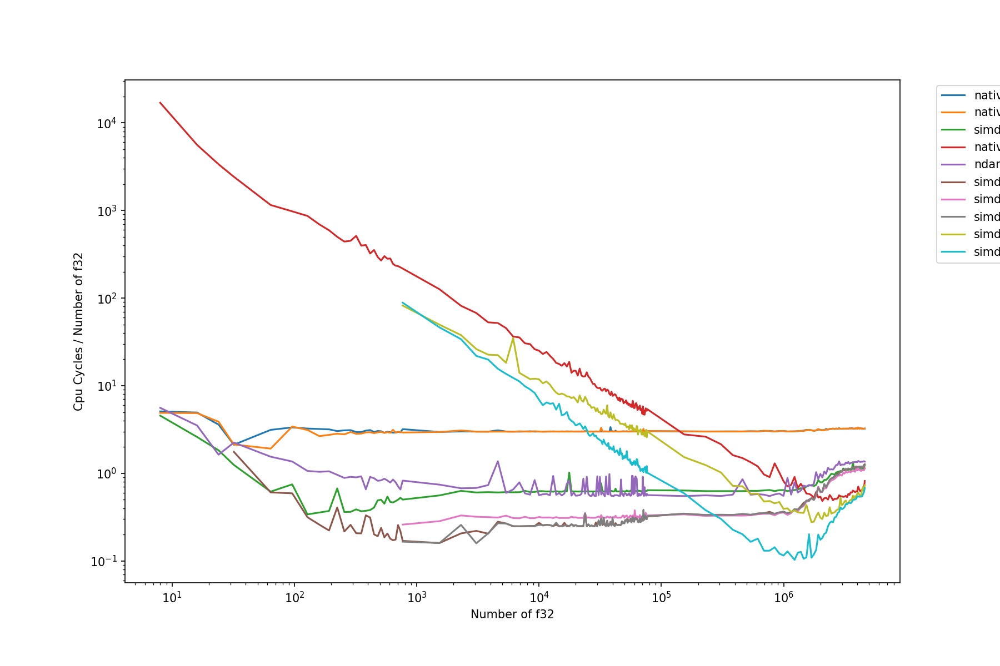

# benchmark_dotproduct
A quick and dirty benchmark of various implementation of the dot product between two vectors.

To run the benchmarks use:
```bash
RUSTFLAGS="-C target-cpu=native" cargo run --release | tee data.csv
```
